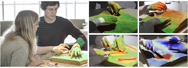

## Books
   

   [Using data visualizations to foster emotion regulation during self-regulated learning with advanced learning technologies](https://link.springer.com/chapter/10.1007/978-3-319-64274-1_10)

   Azevedo, R., Taub, M., Mudrick, N. V., **Millar, G. C.**, Bradbury, A. E., & Price, M. J. (2017)._Using data visualizations to foster emotion regulation during self-regulated learning with advanced learning technologies_. In Informational Environments (pp. 225-247). Springer, Cham. https://doi.org/10.1007/978-3-319-64274-1_10

   Emotions play a critical role during learning and problem solving with advanced learning technologies. However, learners typically do not accurately monitor and regulate their emotions and may therefore not learn as much, disengage from the task, and not optimize their learning of the instructional material. We present a theoretically-based and empirically-driven conceptual framework that addresses emotion regulation by proposing the use of visualizations of one’s and others’ CAMM-SRL multichannel data (e.g., cognitive strategy use, metacognitive monitoring accuracy, facial expressions of emotions, physiological arousal, eye-movement behaviors, etc.) to facilitate learners’ monitoring and regulation of their emotions during learning with advanced learning technologies. We conclude with future directions that can lead to a systematic interdisciplinary research agenda that addresses outstanding emotion regulation-related issues by integrating models, theories, methods, and analytical techniques for the areas of cognitive, learning, and affective sciences, human computer interaction, data visualization, big data, data mining, data science, learning analytics, open learner models, and SRL.

## Papers

   
   
   [Tangible Landscape: A Hands-on Method for Teaching Terrain Analysis](https://dl.acm.org/citation.cfm?id=3173954) 

   **Millar G.**, Tabrizian P., Petrasova A., Petras V., Harmon B., Mitasova H., Meetenmeyer R. 2018. _Tangible Landscape: A Hands-on Method for Teaching Terrain Analysis_. Proceedings of the 2018 CHI Conference on Human Factors in Computing Systems, Montréal, Canada. 
   **[Winner of the Honorable Mention for Best Paper Award]**

   This paper presents novel and effective methods for teaching about topography--or shape of terrain--and assessing 3-dimensional spatial learning using tangibles. We used Tangible Landscape--a tangible interface for geospatial modeling--to teach multiple hands-on tangible lessons on the concepts of grading (ie, earthwork), geomorphology, and hydrology. We examined students' ratings of the system's usability and user experience and tested students' acquisition and transfer of knowledge. Our results suggest the physicality of the objects enabled the participants to effectively interact with the system and each other, positively impacting ratings of usability and task-specific knowledge building. These findings can potentially advance the design and implementation of tangible teaching methods for the topics of geography, design, architecture, and engineering.
   
   [PDF from researchgate.net](https://www.researchgate.net/profile/Brendan_Harmon2/publication/322355724_Tangible_Landscape_A_Hands-on_Method_for_Teaching_Terrain_Analysis/links/5a753deb45851541ce566c0c/Tangible-Landscape-A-Hands-on-Method-for-Teaching-Terrain-Analysis.pdf)
   
   
   
   [Creating Content Guidelines for Consistent Display of Information on an Ecommerce Website](http://journals.sagepub.com/doi/abs/10.1177/1541931213601939) 

   Pryor, M., **Millar, G.C.**, McNamara, A., Kaufman, L., & McLaughlin, A.C. _Creating Content Guidelines for Consistent Display of Information on an Ecommerce Website_. Proceedings of the Human Factors and Ergonomics Society Annual Meeting 2018. SAGE Publications.

   As part of a project in collaboration with Lenovo’s Global UX team, we analyzed a website using heuristic analysis, a cognitive walkthrough, and feedback from users through verbal protocols. With this information, we created a prototype version of proposed content guidelines. These guidelines aim to improve consistency on the website, which allowed users to quickly compare multiple laptops as well as make connections between the laptop hardware and typical uses. In this paper, we describe our process behind developing these guidelines and the resulting guidelines themselves to show how researchers may develop their own guidelines.
   
   [PDF from sagepub.com](http://journals.sagepub.com/doi/pdf/10.1177/1541931213601939)
   
   
   
   [Are pedagogical agents’ external regulation effective in fostering learning with intelligent tutoring systems?](https://link.springer.com/chapter/10.1007/978-3-319-39583-8_19) 

   Azevedo, R., Taub, M., Mudrick, N. V., **Millar, G. C.**, & Bradbury, A. E. _Are
pedagogical agents’ external regulation effective in fostering learning with
intelligent tutoring systems?_. 2016 International Conference on Intelligent Tutoring Systems. Springer, Cham.

   In this study we tested whether external regulation provided by artificial pedagogical agents (PAs) was effective in facilitating learners’ self-regulated learning (SRL) and can therefore foster complex learning with a hypermedia-based intelligent tutoring system. One hundred twenty (N = 120) college students learned about the human circulatory system with MetaTutor during a 2-hour session under one of two conditions: adaptive scaffolding (AS) or a control (C) condition. The AS condition received timely prompts from four PAs to deploy various cognitive and metacognitive SRL processes, and received immediate directive feedback concerning the deployment of the processes. By contrast, the C condition learned without assistance from the PAs. Results indicated that those in the AS condition gained significantly more knowledge about the science topic than those in the C condition. In addition, log-file data provided evidence of the effectiveness of the PAs’ scaffolding and feedback in facilitating learners’ (in the AS condition) metacognitive monitoring and regulation during learning. We discuss implications for the design of external regulation by PAs necessary to accurately detect, track, model, and foster learners’ SRL by providing more accurate and intelligent prompting, scaffolding, and feedback regarding SRL processes.
   
## Posters

   
   
   [AGU 2017: Learning topography with Tangible Landscape games](https://github.com/petrasovaa/soil-visualization-poster)

   Petrasova A., Tabrizian P., Harmon A. B., Petras V., **Millar G.**, Mitasova H., Meentemeyer K. R. 2017. _Learning topography with Tangible Landscape games_. Abstract ED21B-0280 presented AGU Fall Meeting 2017, New Orleans 11-15 December. [AGU link](https://agu.confex.com/agu/fm17/meetingapp.cgi/Paper/264949) and [poster](https://petrasovaa.github.io/agu-2017-tangible-teaching-poster/Petrasova_tangible.pdf)

   Understanding topography and its representations is crucial for correct interpretation and modeling of surface processes. However, novice earth science and landscape architecture students often find reading topographic maps challenging. As a result, many students struggle to comprehend more complex spatial concepts and processes such as flow accumulation or sediment transport. We developed and tested a new method for teaching hydrology, geomorphology, and grading using Tangible Landscape—a tangible interface for geospatial modeling. Tangible Landscape couples a physical and digital model of a landscape through a real-time cycle of hands-on modeling, 3D scanning, geospatial computation, and projection. With Tangible Landscape students can sculpt a projection-augmented topographic model of a landscape with their hands and use a variety of tangible objects to immediately see how they are changing geospatial analytics such as contours, profiles, water flow, or landform types. By feeling and manipulating the shape of the topography, while seeing projected geospatial analytics, students can intuitively learn about 3D topographic form, its representations, and how topography controls physical processes. Tangible Landscape is powered by GRASS GIS, an open source geospatial platform with extensive libraries for geospatial modeling and analysis. As such, Tangible Landscape can be used to design a wide range of learning experiences across a large number of geoscience disciplines. As part of a graduate level course that teaches grading, 16 students participated in a series of workshops, which were developed as serious games to encourage learning through structured play. These serious games included 1) diverting rain water to a specified location with minimal changes to landscape, 2) building different combinations of landforms, and 3) reconstructing landscapes based on projected contour information with feedback. In this poster, we will introduce Tangible Landscape, and describe the games and their implementation. We will then present preliminary results of a user experience survey we conducted as part of the workshops. All developed materials and software are open source and available online.

## Presentations
