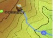

## Papers
 
Variability in Trends and Indicators of CO2 Exchange across Arctic Wetlands

**Coffer M.** & Hestir, E. (2019) Variability in Trends and Indicators of CO2 Exchange across Arctic Wetlands. _Journal of Geophysical Research: Biogeosciences_ (under review). 

Arctic wetlands store nearly half of the world's soil organic carbon, and are crucial to the global carbon cycle. However, most Earth system models fail to account for wetlands given heterogeneity and uncertainty surrounding the response of different wetland types to climate change. We analyzed summer (June-August) carbon dioxide (CO2) exchange, meteorological conditions, and ecological conditions at four Arctic wetlands. Micrometeorological flux tower data were used to assess CO2 exchange and meteorological conditions across 7 to 9 years of data. Climate data were used to assess meteorological conditions across 30 years of data. Satellite data described ecological conditions. Each site acted as a CO2 sink, but strength varied, ranging from -49 to -93 g C m-2 summer-1. A trend analysis was used to investigate how CO2 balance and surrounding conditions may have changed. CO2 exchange significantly changed at one site, becoming a stronger sink. Changes in meteorological conditions were variable across sites with the exception of air temperature which, when considering significant trends, unanimously increased across sites. Ecological conditions suggested increased vegetation cover regardless of statistical significance at all sites. A conditional random forest algorithm was used to evaluate drivers of CO2 exchange. Cumulative precipitation and evapotranspiration were the main drivers of net ecosystem exchange and gross primary productivity, while ecosystem respiration was mainly driven by air temperature, suggesting that projected changes in temperature and precipitation will influence the carbon balance of Arctic wetlands. Variability across sites emphasizes the need for long-term observations across wetland types and climatic gradients.

[A method for quantifying the number of U.S. lakes with cyanobacterial harmful algal blooms using satellite remote sensing](https://www.spiedigitallibrary.org/conference-proceedings-of-spie/10767/0000/A-method-for-quantifying-the-number-of-US-lakes-with/10.1117/12.2319669.short?SSO=1) 

**Coffer M.**, Schaeffer, B., Uruqhart, E., Darling, J. & Salls, W. (2018) A method for quantifying the number of U.S. lakes with cyanobacterial harmful algal blooms using satellite remote sensing. _Proc. SPIE 10767, Remote Sensing and Modeling of Ecosystems for Sustainability XV, 1076709_. doi: 

Cyanobacterial harmful algal blooms are the most common form of harmful algal blooms in freshwater systems throughout the world. However, in situ sampling of cyanobacteria in inland lakes is limited both spatially and temporally. Satellite data has proven to be an effective tool to monitor cyanobacteria in freshwater lakes across the United States. This study uses data from the European Space Agency MEdium Resolution Imaging Spectrometer and the Sentinel-3 Ocean and Land Color Instrument to provide a national overview of the percentage of lakes experiencing a cyanobacterial bloom on a weekly basis for 2008-2011 and 2017. A total of 2,370 lakes across the contiguous United States were included in the analysis. Bloom percentage was calculated for nine United States climate regions to examine regional patterns. Changes in cyanobacterial bloom percentage followed the well-known temporal pattern of freshwater blooms. The percentage of lakes experiencing a bloom increased throughout the year, reached a peak around October, and decreased through the winter. Wintertime data, particularly in the northern latitude regions, was consistently limited due to snow and ice cover. With the exception of the Southeast and South climate regions, regional patterns mimicked patterns found at the national scale. The Southeast and South regions exhibited an unexpected pattern as cyanobacterial bloom percentage peaked in the winter rather than the summer. Several environmental factors and potential satellite limitations can possibly explain these findings. Results from this research can help establish a baseline of annual occurrence of cyanobacterial blooms in inland lakes across the United States.
   
[PDF from sagepub.com](http://journals.sagepub.com/doi/pdf/10.1177/1541931213601939)

   
## Posters

   
[AGU 2017: Learning topography with Tangible Landscape games](https://github.com/petrasovaa/soil-visualization-poster)

Petrasova A., Tabrizian P., Harmon A. B., Petras V., **Millar G.**, Mitasova H., Meentemeyer K. R. 2017. _Learning topography with Tangible Landscape games_. Abstract ED21B-0280 presented AGU Fall Meeting 2017, New Orleans 11-15 December. [AGU link](https://agu.confex.com/agu/fm17/meetingapp.cgi/Paper/264949) and [poster](https://petrasovaa.github.io/agu-2017-tangible-teaching-poster/Petrasova_tangible.pdf)

Understanding topography and its representations is crucial for correct interpretation and modeling of surface processes. However, novice earth science and landscape architecture students often find reading topographic maps challenging. As a result, many students struggle to comprehend more complex spatial concepts and processes such as flow accumulation or sediment transport. We developed and tested a new method for teaching hydrology, geomorphology, and grading using Tangible Landscape—a tangible interface for geospatial modeling. Tangible Landscape couples a physical and digital model of a landscape through a real-time cycle of hands-on modeling, 3D scanning, geospatial computation, and projection. With Tangible Landscape students can sculpt a projection-augmented topographic model of a landscape with their hands and use a variety of tangible objects to immediately see how they are changing geospatial analytics such as contours, profiles, water flow, or landform types. By feeling and manipulating the shape of the topography, while seeing projected geospatial analytics, students can intuitively learn about 3D topographic form, its representations, and how topography controls physical processes. Tangible Landscape is powered by GRASS GIS, an open source geospatial platform with extensive libraries for geospatial modeling and analysis. As such, Tangible Landscape can be used to design a wide range of learning experiences across a large number of geoscience disciplines. As part of a graduate level course that teaches grading, 16 students participated in a series of workshops, which were developed as serious games to encourage learning through structured play. These serious games included 1) diverting rain water to a specified location with minimal changes to landscape, 2) building different combinations of landforms, and 3) reconstructing landscapes based on projected contour information with feedback. In this poster, we will introduce Tangible Landscape, and describe the games and their implementation. We will then present preliminary results of a user experience survey we conducted as part of the workshops. All developed materials and software are open source and available online.

## Presentations
